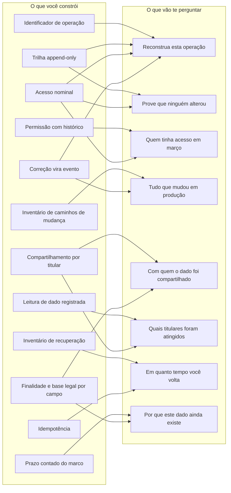

# O mapa

Esta página existe para quem quer ver o conjunto antes de escolher por onde
entrar. Ela tem duas coisas: o que sustenta o quê, e o que ainda dá para
decidir depois.

Se você tem cinco minutos e precisa levar alguma coisa para uma reunião, é a
tabela do fim que serve.

## O que sustenta o quê

Quase nenhuma exigência é independente. A trilha do capítulo 2 não prova nada
sem o acesso nominal do capítulo 4. A resposta ao titular do capítulo 8 só
existe se o compartilhamento do capítulo 7 tiver sido registrado quando
aconteceu. O desenho abaixo é essa dependência.

Duas leituras úteis desse desenho.

A primeira: o acesso nominal aparece sustentando três perguntas diferentes. Se
existe uma conta compartilhada no seu ambiente, ela não é um problema de
segurança isolado. Ela derruba a trilha inteira, e a trilha é a base de quase
todo o resto. É por isso que ele é o primeiro item do
[checklist](99-checklist.md).

A segunda: as caixas da esquerda são decisões de modelagem, não funcionalidades.
Nenhuma delas aparece numa tela. Isso explica por que elas nunca entram no
roadmap sozinhas, e é o assunto do [capítulo 1](01-por-que-chega-tarde.md).

## O que ainda dá para decidir depois

A coluna que importa é a última. Onde está "não", a janela de decisão já passou
para o dado que existe hoje: você consegue passar a fazer certo daqui para a
frente, e o histórico anterior fica como está.

| Decisão | Onde | Quando se decide | O que acontece se ficar para depois | Reversível |
|---|---|---|---|---|
| Identificador de operação que atravessa serviços, filas e jobs | [2](02-trilha-de-auditoria.md) | No desenho do fluxo | Só vale da adoção em diante; o histórico antigo não ganha correlação | Não |
| Trilha append-only, sem `UPDATE` nem `DELETE` | [2](02-trilha-de-auditoria.md) | Antes da primeira escrita | O que foi sobrescrito não volta | Não |
| Guardar o valor anterior em toda mudança de estado | [2](02-trilha-de-auditoria.md) | Na modelagem | Você sabe que mudou, não o que mudou | Não |
| Encadeamento por hash na trilha | [2](02-trilha-de-auditoria.md) | Pode entrar depois | Passa a provar integridade só a partir da adoção | Parcial |
| Ingerir o canal externo que participa da operação | [2](02-trilha-de-auditoria.md) | Antes de a operação passar por ele | Fica um buraco no trecho que mais interessa | Não |
| Acesso nominal, sem conta compartilhada | [4](04-segregacao-de-acesso.md) | Antes de a trilha valer alguma coisa | Os registros antigos ficam sem autoria utilizável | Parcial |
| Permissão como evento, com histórico de concessão | [4](04-segregacao-de-acesso.md) | Na modelagem | Não dá para dizer quem tinha acesso a quê numa data passada | Não |
| Registrar leitura de dado de cliente | [4](04-segregacao-de-acesso.md) | Antes do primeiro incidente | Num vazamento, a extensão não pode ser determinada | Não |
| Prazo contado do marco de negócio, não da criação | [3](03-retencao.md) | Na modelagem da operação | Dá para corrigir, e o recálculo em massa é caro e arriscado | Sim, com custo |
| Marcação que bloqueia expurgo de operação em disputa | [3](03-retencao.md) | Antes do primeiro expurgo | Alguém apaga exatamente o que estava sendo discutido | Não |
| Correção por script gerando evento na trilha | [5](05-mudanca-em-producao.md) | Antes da primeira correção | As correções antigas ficam como saltos inexplicados no histórico | Não |
| Registro de feature flag e de parâmetro de negócio | [5](05-mudanca-em-producao.md) | A qualquer momento | O histórico anterior de quem mudou o quê não existe | Parcial |
| Migração em três passos, para poder reverter sem backup | [5](05-mudanca-em-producao.md) | Em cada mudança de esquema | A reversão daquela versão específica exige restaurar backup | Sim |
| Idempotência nas entradas | [6](06-continuidade-e-recuperacao.md) | No desenho da integração | O reprocessamento depois do incidente duplica lançamento | Sim, com custo alto |
| Máscara aplicada na origem antes de enviar telemetria | [7](07-fornecedores-e-terceiros.md) | Antes de ligar a ferramenta | O que já foi enviado está lá, e o histórico costuma ser longo | Parcial |
| Compartilhamento com terceiro registrado por titular | [7](07-fornecedores-e-terceiros.md) | Antes do primeiro compartilhamento | A resposta ao titular vira frase genérica | Não |
| Finalidade e base legal por campo | [8](08-lgpd-no-backend.md) | Na modelagem do cadastro | Vira levantamento manual retroativo, campo por campo | Sim, com custo |
| Prompt, resposta e versão exata do modelo na trilha | [9](09-ia-e-dado-pessoal.md) | Antes de usar modelo em decisão | A decisão antiga não se reproduz nem se explica | Não |

## Como usar isso

Se o sistema ainda não existe, a tabela é a lista do que precisa estar decidido
antes da primeira linha. São dezoito itens e nenhum deles é caro nessa fase.

Se o sistema já está em produção, a tabela é outra coisa: é o argumento. As
linhas com "não" na última coluna são as que perdem valor a cada mês que passa,
e é com elas que se defende prioridade, porque o custo de adiar não é constante,
ele cresce. Como conduzir essa conversa é o
[capítulo 10](10-a-conversa-com-quem-paga.md).

Para saber onde você está antes de decidir qualquer coisa, o
[checklist](99-checklist.md) percorre tudo em uma tarde.
